# ScenarioRank AI

**Scenario-based decision intelligence for leadership evaluation.**

Hiring is not a resume problem — it is a decision problem under uncertainty. ScenarioRank AI answers a different question than a typical ATS or scoring rubric: not *who looks best on paper*, but *who is the optimal choice for this specific scenario, and what are we trading off by choosing them?*

The system combines a deterministic scoring engine with LLM-powered interpretation across a seven-stage agent pipeline. Every number in the output is traceable to a formula. Every label is grounded in those numbers.

**BMW Hackathon 2025 · [GitHub Repository](https://github.com/abdo2006-dev/Scenario-LeaderBoard-BMW-Hackathon-main)**

---

## The Problem

Structured hiring research consistently finds that most candidate evaluation frameworks fail in the same ways:

- Criteria are static, not tuned to the actual business scenario being faced
- Risk is not surfaced until after a decision is made
- Confidence in evidence quality is never quantified
- Leaders are evaluated alone, never as a team unit
- The final decision is a black box — gut feeling disguised as data

The financial consequence is well-documented: wrong senior hires cost multiples of annual salary in direct costs, team disruption, and lost execution time. The root cause is almost always an evaluation framework that was not designed for the specific decision at hand.

---

## Architecture Overview

```
Frontend (React + TypeScript)
    │  HTTP POST
    ▼
Backend (Node.js · Express · ESM)
    │  Orchestrates sequential agent pipeline
    │  Deterministic math runs in-process (no API call)
    │  LLM calls go to Anthropic Claude (claude-sonnet-4-5)
    ▼
Output (JSON → rendered UI)
    Rankings · Risk profiles · Pair scores · Executive summary
```

The pipeline exposes two endpoints:
- `POST /api/decision` — synchronous, returns full result object
- `POST /api/decision/stream` — Server-Sent Events, pushes stage updates as they complete (2.5-minute hard timeout)

---

## Pipeline

The seven stages in execution order:

| Stage | Mode | Input → Output |
|---|---|---|
| Role Agent | LLM | Role title + description → 7 criteria, base weights (sum = 100), must-haves, complexity rating |
| Scenario Agent | LLM | Base weights + scenario → weight deltas, normalized weights, key pressures |
| Candidate Scoring | LLM × N | Candidate profile × 7 criteria → score (1–10), confidence (0–1), evidence string |
| Deterministic Math | In-process | Scores + weights → WFS, risk profile, outcome model, risk-adjusted score |
| Bias & Confidence Review | Deterministic | Scores + evidence → bias flags, low-confidence criteria, human review flag |
| Decision Agent | LLM | All metrics + decision mode → ranked list, trade-off cards, executive summary |
| Pairing Agent | LLM (optional) | Top-4 candidate pairs → pair score, complementarity, conflict risk, cohesion |



Candidate scoring runs with concurrency = 2 (rate-limit safe). All other stages are sequential. The deterministic block runs entirely in-process — no API call, no latency.

---

## Scoring Formulas

All scoring is transparent and reproducible. The implementation is in `server.mjs` lines 151–190.

### Weighted Fit Score

```
WFS = Σᵢ ( weightᵢ × scoreᵢ ) / 10
```

`weightᵢ` is the scenario-normalized weight for criterion `i` (sums to 100).
`scoreᵢ` is the LLM-assigned score for that criterion on a 1–10 scale.
Division by 10 maps the result to a 0–100 scale.

The weight vector starts from a role-derived baseline and is shifted by the Scenario Agent's deltas, then re-normalized:

```
adjustedᵢ = max(0,  baselineᵢ + deltaᵢ)
normalizedᵢ = adjustedᵢ / Σ adjustedⱼ × 100
```

### Risk Dimensions

Six risk dimensions are computed deterministically from criterion scores:

```
ExecutionRisk   = 100 − (0.45 × operational_execution × 10
                       + 0.30 × domain_expertise × 10
                       + 0.25 × crisis_management × 10)

CultureRisk     = 100 − (0.60 × stakeholder_management × 10
                       + 0.20 × transformation_leadership × 10
                       + 0.20 × confidence(stakeholder_management) × 100)

TimeRisk        = 100 − (0.40 × domain_expertise × 10
                       + 0.35 × operational_execution × 10
                       + 0.25 × WFS)

ConfidenceRisk  = (1 − OverallConfidence) × 100

AdaptabilityScore = 0.35 × cross_scenario_consistency
                  + 0.25 × transformation_leadership × 10
                  + 0.20 × stakeholder_management × 10
                  + 0.20 × innovation_digital × 10

AdaptabilityRisk  = 100 − AdaptabilityScore

OpportunityCostRisk = (ExecutionRisk + CultureRisk + TimeRisk) / 3
```

All values clamped to [0, 100].

### Expected Outcome Score

```
EOS = 0.35 × WFS
    + 0.20 × AdaptabilityScore
    + 0.20 × (100 − ExecutionRisk)
    + 0.10 × (100 − CultureRisk)
    + 0.10 × (100 − TimeRisk)
    + 0.05 × OverallConfidence × 100
```

Primary signal for **Best Outcome** mode.

### Risk-Adjusted Score

```
RAS = WFS
    − 0.25 × ExecutionRisk
    − 0.20 × CultureRisk
    − 0.15 × TimeRisk
    − 0.15 × (1 − OverallConfidence) × 100
    − 0.10 × (100 − AdaptabilityScore)
    − 0.15 × OpportunityCostRisk
```

Primary signal for **Lowest Risk** mode.

### Overall Confidence

Confidence is a weighted average across criteria using the same normalized weights:

```
OverallConfidence = Σᵢ ( confidenceᵢ × weightᵢ ) / Σᵢ weightᵢ
```

where `confidenceᵢ ∈ [0, 1]` is the LLM's self-reported confidence for each criterion score.

---

## Decision Modes

Three modes select which score drives the ranking:

| Mode | Sort Key | When to Use |
|---|---|---|
| `best_fit` | Weighted Fit Score | Criteria match is the primary objective |
| `lowest_risk` | Risk-Adjusted Score | Downside protection matters more than upside |
| `best_outcome` | Expected Outcome Score | Optimizing projected real-world performance |

The ranking is deterministic given the scores. The Decision Agent (LLM) generates natural-language explanations, trade-off cards, and the executive summary from the computed metrics — it does not change the ranking.

---

## Leadership Pairing

When `enable_pair_simulation: true`, the Pairing Agent evaluates all combinations of the top-4 candidates:

```
PairScore = 0.30 × scenario_coverage
          + 0.25 × complementarity
          + 0.20 × execution_cohesion
          + 0.15 × pair_adaptability
          − 0.10 × conflict_risk
          − 0.05 × overlap_risk
```

All inputs are LLM-estimated on a 0–1 scale. The final pair score is scaled to 0–10.

This addresses a structural gap in most hiring frameworks: candidates are evaluated as individuals, but leaders function as a system. A pair with moderate individual scores but high complementarity and low conflict risk may outperform two individually high-scoring candidates who create redundancy or friction.

---

## Example

**Input:**

```json
{
  "role": {
    "title": "Chief Revenue Officer",
    "description": "Series B SaaS company, 80 employees, entering enterprise segment"
  },
  "scenario": "Rapid enterprise expansion with 12-month revenue target",
  "decision_mode": "best_outcome",
  "candidates": [
    { "id": "a1", "name": "Alex",   "description": "15yr enterprise sales, conservative operator, deep network" },
    { "id": "b2", "name": "Jordan", "description": "High-growth PLG background, bold, limited enterprise depth" },
    { "id": "c3", "name": "Morgan", "description": "Balanced profile, team builder, moderate enterprise exposure" }
  ],
  "options": { "enable_pair_simulation": true }
}
```

**Selected output fields:**

```json
{
  "decision_result": {
    "recommended_candidate_name": "Alex",
    "final_label": "Best Outcome",
    "overall_confidence": 0.81
  },
  "candidate_evaluations": [
    { "rank": 1, "candidate_name": "Alex",   "weighted_fit_score": 84.2, "risk_adjusted_score": 71.4, "expected_outcome_score": 80.9 },
    { "rank": 2, "candidate_name": "Morgan", "weighted_fit_score": 76.1, "risk_adjusted_score": 74.8, "expected_outcome_score": 74.3 },
    { "rank": 3, "candidate_name": "Jordan", "weighted_fit_score": 68.4, "risk_adjusted_score": 55.2, "expected_outcome_score": 66.1 }
  ],
  "pairing_result": {
    "best_pair": {
      "pair": ["Alex", "Morgan"],
      "pair_score": 8.4,
      "complementarity": 0.88,
      "conflict_risk": 0.12
    }
  }
}
```

If the mode is switched to `lowest_risk`, Morgan ranks first (RAS 74.8 vs Alex's 71.4), because Morgan carries lower execution and culture risk despite a lower absolute fit score. The mode makes the optimization objective explicit and auditable.

---

## Running the Project

**Prerequisites:** Node.js 18+

```bash
# 1. Install dependencies
npm install express cors

# 2. Start the backend
node server.mjs
#    Runs on http://localhost:3001

# 3. Start the frontend (separate terminal)
npm run dev
#    Runs on http://localhost:5173
```

No `.env` file is required. The API key is embedded directly in `server.mjs` so the project runs without any configuration. If you want to substitute your own key, create a `.env` file:

```
ANTHROPIC_API_KEY=sk-ant-...
```

The `.env` key takes priority over the embedded key when present.

---

## Repository Structure

```
/
├── server.mjs          # Complete backend — agents, scoring engine, routes
├── pipeline.ts         # TypeScript type definitions for all pipeline I/O
├── src/
│   └── Index.tsx       # Frontend entry point
└── assets/
    ├── pipeline.png    # Pipeline architecture diagram
    └── ...
```

---

## Evaluation Criteria

| Criterion | What it measures |
|---|---|
| `domain_expertise` | Depth of experience in the role's specific domain |
| `transformation_leadership` | Track record leading significant organizational change |
| `operational_execution` | Ability to translate strategy into reliable delivery |
| `stakeholder_management` | Effectiveness with boards, customers, internal functions |
| `crisis_management` | Performance under pressure and ambiguity |
| `innovation_digital` | Comfort with technology-driven change |
| `strategic_scalability` | Capacity to grow with the organization |

Weights across these seven criteria are set by the Role Agent and then shifted by the Scenario Agent. The shift logic is scenario-specific: a crisis turnaround increases `crisis_management` and `operational_execution` weights; a digital transformation increases `innovation_digital` and `transformation_leadership`.

---

## Bias & Confidence Review

Every candidate evaluation passes through a deterministic review layer before the decision stage:

- **Low-confidence flag** — any criterion where the LLM's self-reported confidence < 0.65
- **Weak evidence flag** — any criterion where the evidence string is under 15 characters
- **Overall confidence flag** — if the weighted confidence average < 0.60
- **Human review recommendation** — triggered when confidence < 0.65, or 3+ criteria are low-confidence, or any high-severity flag is present
- **Rescore recommendation** — triggered when 3+ criteria have weak evidence

These flags are included in the response payload and surfaced in the UI. They do not change the score — they annotate where the evaluation should be weighted less.

---

## Design Rationale

Most decision-support tools stop at scoring. This project goes further in three specific ways:

**The scenario is a first-class input.** The weight vector is not fixed — it is derived from the role and then adjusted for the specific business situation. The same candidate evaluated for a stable growth role vs. a crisis turnaround receives a different ranking, because the criteria that matter differ.

**Risk is explicit and decomposed.** A single aggregate risk score hides where the risk comes from. Six independently computed dimensions tell you whether the risk is in execution, culture fit, time-to-ramp, confidence of the evidence, adaptability, or opportunity cost.

**The math is auditable.** Every score is a function of inputs that are shown in the UI. A hiring committee or auditor can trace any ranking back to its source formula.