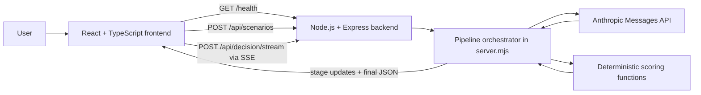

# ScenarioRank AI V2

**Scenario-aware decision support for comparing leadership candidates under different business conditions.**

> **Project status:** V2 engineering refinement in progress. The `main` branch is the public source of truth and is intentionally being upgraded from the BMW hackathon implementation into a better-tested, better-documented, and more defensible system.

ScenarioRank AI received **Best Implementation** in a BMW-related competition. The original award-winning snapshot is preserved separately as the [`bmw-award-original`](https://github.com/abdo2006-dev/ScenarioRank-AI/tree/bmw-award-original) tag and [`archive/bmw-award-original`](https://github.com/abdo2006-dev/ScenarioRank-AI/tree/archive/bmw-award-original) branch.

## Why V2 exists

The competition version demonstrated a strong product idea and a complete end-to-end user experience, but it also contains hackathon-era shortcuts. V2 is a deliberate post-award engineering effort to:

- make the architecture explicit and understandable;
- separate LLM interpretation from deterministic decision logic;
- remove hardcoded or misleading outputs;
- validate all model responses and API inputs;
- add meaningful automated tests and evaluation cases;
- improve security, observability, deployment, and documentation;
- make every important design choice explainable in an interview or technical review.

This repository documents both what currently exists and what will change. See [`docs/`](./docs/README.md) — start with [`docs/PROJECT_STATUS.md`](./docs/PROJECT_STATUS.md) for the current state, decisions made, and next planned step.

## Important scope statement

ScenarioRank is a **research and decision-support prototype**, not an autonomous hiring system. It must not make final employment decisions, automatically reject candidates, or replace qualified human review. Current scores are based on model interpretation and prototype heuristic formulas; they are not validated predictions of job performance.

## Current baseline architecture


```mermaid
flowchart LR
    U[User] --> F[React + TypeScript frontend]
    F -->|GET /health| B[Node.js + Express backend]
    F -->|POST /api/scenarios| B
    F -->|POST /api/decision/stream via SSE| B
    B --> O[Pipeline orchestrator in server.mjs]
    O --> A[Anthropic Messages API]
    O --> D[Deterministic scoring functions]
    A --> O
    D --> O
    O -->|stage updates + final JSON| F
```

The current implementation is a sequential **LLM-assisted pipeline**, not a collection of fully autonomous agents. Several functions are named “agents,” but orchestration, routing, and control remain in normal application code.

## Current request pipeline

1. **Role analysis — LLM:** derives evaluation criteria, base weights, must-haves, and complexity.
2. **Scenario analysis — LLM:** adjusts and normalizes weights for the selected business scenario.
3. **Candidate scoring — LLM:** scores each candidate across seven criteria and returns confidence, evidence, and reasoning.
4. **Deterministic scoring:** calculates weighted fit, risk dimensions, adaptability, expected outcome, and risk-adjusted scores.
5. **Confidence and evidence review — deterministic:** flags low confidence and weak evidence. The current code calls this “Bias & Confidence Review,” but it does not yet perform a defensible bias audit.
6. **Decision explanation — deterministic ranking + LLM explanation:** code selects the ranking key; the LLM generates explanations and summaries.
7. **Pair simulation — optional LLM + deterministic formula:** estimates pair-level metrics and computes a pair score.

Detailed flow: [`docs/architecture/CURRENT_ARCHITECTURE.md`](./docs/architecture/CURRENT_ARCHITECTURE.md)

## Technology baseline

| Layer | Current technology | Current role |
|---|---|---|
| Frontend | React 18, TypeScript, Vite | Single-page interface and results rendering |
| Styling/UI | Tailwind CSS, selected Radix/shadcn components | Layout and interface primitives |
| Backend | Node.js, Express, ESM | API routes, orchestration, formulas, model calls |
| AI provider | Anthropic Messages API | Role/scenario interpretation, candidate scoring, explanations, pair estimates |
| Streaming | Server-Sent Events | Sends pipeline stage updates and final results |
| Validation | Manual checks and JSON repair | Incomplete; Zod is installed but not used for backend schemas |
| Persistence | None | Runs are not stored |
| Automated testing | Vitest placeholder only | No meaningful coverage yet |

Full inventory: [`docs/architecture/TECHNOLOGY_INVENTORY.md`](./docs/architecture/TECHNOLOGY_INVENTORY.md)

## Known baseline limitations

The V2 audit has already identified several high-priority issues:

- pair simulation currently selects the first four submitted candidates instead of the top four ranked candidates;
- cross-scenario consistency is hardcoded to `75`;
- “best” and “worst” adaptability scenarios are not genuinely simulated;
- the “bias” stage currently checks confidence and evidence length, not demographic or procedural bias;
- model-generated JSON is not validated against strict schemas;
- the backend URL and AI model are hardcoded;
- the main frontend and backend files are oversized and mix responsibilities;
- there is no authentication, rate limiting, persistence, audit trail, or cost tracking;
- the mathematical coefficients are prototype heuristics and have not been empirically calibrated.

See [`docs/architecture/KNOWN_LIMITATIONS.md`](./docs/architecture/KNOWN_LIMITATIONS.md).

## Local development

### Prerequisites

- Node.js 18 or newer
- An Anthropic API key for live AI evaluation

### Setup

```bash
npm install

cp .env.example .env
# Add your key to .env:
# ANTHROPIC_API_KEY=your_key_here
```

Run the backend:

```bash
node server.mjs
```

Run the frontend in a second terminal:

```bash
npm run dev
```

Default local addresses:

- Frontend: `http://localhost:5173`
- Backend: `http://localhost:3001`
- Health check: `http://localhost:3001/health`

Never commit `.env` or API keys.

## V2 documentation

- [Phase 0 baseline audit](./docs/PHASE_0_BASELINE_AUDIT.md)
- [Current architecture](./docs/architecture/CURRENT_ARCHITECTURE.md)
- [Data flows](./docs/architecture/DATA_FLOW.md)
- [Technology inventory](./docs/architecture/TECHNOLOGY_INVENTORY.md)
- [Scoring model and assumptions](./docs/architecture/SCORING_AND_ASSUMPTIONS.md)
- [Known limitations](./docs/architecture/KNOWN_LIMITATIONS.md)
- [Repository map](./docs/REPOSITORY_MAP.md)
- [Branch strategy](./docs/BRANCH_STRATEGY.md)
- [V2 roadmap](./docs/V2_ROADMAP.md)
- [Learning checkpoints](./docs/LEARNING_CHECKPOINTS.md)
- [ADR-0001: main is the V2 line](./docs/decisions/ADR-0001-main-is-v2.md)

## Branch model

- `main` — public V2 source of truth; the branch visitors and recruiters see first.
- `archive/bmw-award-original` — frozen branch containing the competition snapshot.
- `bmw-award-original` — immutable annotated tag for the same snapshot.
- `v2/<work-item>` — short-lived implementation branches merged into `main` through focused pull requests.

The original result is preserved without forcing visitors to land on legacy code.
