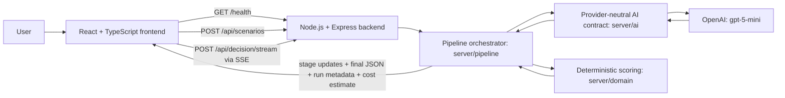

# ScenarioRank AI V2

**Scenario-aware decision support for comparing leadership candidates under different business conditions.**

> **Project status:** Phase 2C is complete and merged to `main` (PR #6,
> squash commit `a07edc4b968d8d3ce71b22fc22d11e58cdc66025`). It migrated
> the frontend build tool from `vite@5.4.21` to `vite@6.4.3` — the minimum
> patched release for the dev-server advisories, which also pulled a
> patched `esbuild` (`0.21.5` → `0.25.12`) transitively, no plugin or
> Vitest version change required — and dropped `npm audit` findings from 4
> to 2. Phases 2A, 2B-1, and 2B-2 are also merged to `main`; see
> [`docs/PROJECT_STATUS.md`](./docs/PROJECT_STATUS.md) for the full
> history of every phase. **Phase 2D (draft, not yet merged, branch
> `v2/phase-2d-react-router7-security`)** applies the React Router
> migration Phase 2C left as the recommended next action:
> `react-router-dom` `6.30.4` → `react-router` `7.18.2` (Declarative Mode
> only — `BrowserRouter`/`Routes`/`Route`/`useLocation`), with
> `react-router-dom` removed entirely rather than kept as a compatibility
> layer, since `react-router@7` officially exports every API this app
> uses directly. `npm audit` findings dropped from 2 to 1; the one
> remaining finding only affects React Router's unstable RSC APIs, which
> this Declarative-Mode-only app does not use, and was deliberately not
> fixed by adopting React Router 8 (out of scope for this phase) — see
> [`docs/decisions/ADR-0008-react-router-7-migration.md`](./docs/decisions/ADR-0008-react-router-7-migration.md)
> and [`docs/security/DEPENDENCY_AUDIT.md`](./docs/security/DEPENDENCY_AUDIT.md)
> ("Phase 2D update"). No scoring, prompt, provider, ranking, pairing,
> HTTP contract, validation, accessibility, or route-content behavior
> changed; no real OpenAI call was made; Phase 3 has not started.

ScenarioRank AI received **Best Implementation** in a BMW-related competition. The original award-winning snapshot is preserved separately as the [`bmw-award-original`](https://github.com/abdo2006-dev/ScenarioRank-AI/tree/bmw-award-original) tag and [`archive/bmw-award-original`](https://github.com/abdo2006-dev/ScenarioRank-AI/tree/archive/bmw-award-original) branch.

## Why V2 exists

The competition version demonstrated a strong product idea and a complete end-to-end user experience, but it also contains hackathon-era shortcuts. V2 is a deliberate post-award engineering effort to:

- make the architecture explicit and understandable;
- separate LLM interpretation from deterministic decision logic;
- remove hardcoded or misleading outputs;
- validate all model responses and API inputs;
- add meaningful automated tests and evaluation cases;
- improve security, observability, deployment, and documentation;
- make every important design choice explainable in an interview or technical review.

This repository documents both what currently exists and what will change. See [`docs/`](./docs/README.md) — start with [`docs/PROJECT_STATUS.md`](./docs/PROJECT_STATUS.md) for the current state, decisions made, and next planned step.

## Important scope statement

ScenarioRank is a **research and decision-support prototype**, not an autonomous hiring system. It must not make final employment decisions, automatically reject candidates, or replace qualified human review. Current scores are based on model interpretation and prototype heuristic formulas; they are not validated predictions of job performance.

## Current baseline architecture


```mermaid
flowchart LR
    U[User] --> F[React + TypeScript frontend]
    F -->|GET /health| B[Node.js + Express backend]
    F -->|POST /api/scenarios| B
    F -->|POST /api/decision/stream via SSE| B
    B --> O[Pipeline orchestrator: server/pipeline]
    O --> P[Provider-neutral AI contract: server/ai]
    P --> A[OpenAI: gpt-5-mini]
    O --> D[Deterministic scoring: server/domain]
    A --> P
    P --> O
    D --> O
    O -->|stage updates + final JSON + run metadata + cost estimate| F
```

The current implementation is a sequential **LLM-assisted pipeline**, not a collection of fully autonomous agents. Every LLM call goes through a provider-neutral contract (`server/ai/`) — never a vendor SDK directly from the pipeline — so `runPipeline.js` has no OpenAI-specific code in it, even though there is currently exactly one supported provider. See [`docs/decisions/ADR-0004-single-openai-provider.md`](./docs/decisions/ADR-0004-single-openai-provider.md) for why Groq and Gemini (both real, tested integrations from an earlier phase) were removed rather than kept as dormant alternatives, and [`docs/decisions/ADR-0002-provider-abstraction.md`](./docs/decisions/ADR-0002-provider-abstraction.md) for why the contract itself still exists with a single provider.

Phase 2A keeps the user flow but gives the browser a feature boundary:
`src/features/decision/api` owns validated HTTP/SSE transport,
`hooks/useDecisionEvaluation.ts` owns workflow state, and `components/`
separates the screen, landing, evaluation, progress, results, and display
primitives. Public payloads are Zod schemas in `shared/contracts/`; provider
schemas remain internal to `server/ai/schemas/`.

## Current request pipeline

A normal evaluation (up to `AI_MAX_CANDIDATES` candidates, pairing enabled) uses **at most 4 logical model-backed pipeline stages** — a fixed architectural fact, not the same claim as "at most 4 OpenAI API requests": each logical stage can take more than one real attempt (a schema-validation or truncation retry, or a batch-integrity corrective call), which is why the response separately reports `logicalProviderStageCount` (bounded at 4) and `providerAttemptCount` (the real, aggregated attempt total, which can be higher):

1. **Combined context analysis — LLM, one logical stage:** derives evaluation criteria, base weights, must-haves, complexity, and the scenario's weight adjustments together. The UI still shows "Role Analysis" and "Scenario Analysis" as separate pipeline stages — one provider call now produces both; a logical pipeline stage does not necessarily equal one network request.
2. **Batch candidate scoring — LLM, one logical stage:** scores every submitted candidate across seven criteria in a single request, returning confidence, evidence, and reasoning per candidate. Results are mapped back to candidates by a stable ID, never by array position; a duplicate, missing, or unknown result is rejected (with at most one corrective retry, whose real attempt is added to the total, never discarded), never silently defaulted.
3. **Deterministic scoring:** calculates weighted fit, risk dimensions, adaptability, expected outcome, risk-adjusted scores, and the top-four ranking.
4. **Confidence and evidence review — deterministic:** flags low confidence and weak evidence. Not a demographic or procedural bias audit.
5. **Batch pairing analysis — optional LLM, one logical stage:** evaluates every relevant pair among the top four *ranked* candidates in a single request. **A successful pairing result means every expected pair was returned and validated — a subset is never classified as a successful "best pair" analysis.** Any missing, duplicate, or unrequested pair is rejected (with one corrective retry); if the batch is still incomplete afterward, the response honestly reports `{"status":"unavailable","reason":"Complete pair analysis was unavailable.", ...}` — never a fabricated or partial pair.
6. **Decision explanation — deterministic ranking + LLM explanation:** code selects the ranking key and computes the winner before this call; the LLM only generates explanations and summaries from the already-computed result (optionally referencing the pairing result) and can never change the ranking.

Every LLM-backed stage is schema-validated (Zod) before its output is used. Every response includes `run_metadata`: provider, model, `logicalProviderStageCount`, `providerAttemptCount`, input/cached-input/output/reasoning/total token counts, an estimated cost (or `null` for an unrecognized model — never a guessed number), prompt/schema versions, attempts, and timestamps. Token/cost totals are only ever aggregated from attempts that returned a completed response with usage data — an attempt that fails before returning any response body has no usage to report, so the estimate can honestly under-report true spend in that case; see `server/ai/pricing/openaiPricing.js`. Detailed flow: [`docs/architecture/CURRENT_ARCHITECTURE.md`](./docs/architecture/CURRENT_ARCHITECTURE.md)

## Technology baseline

| Layer | Current technology | Current role |
|---|---|---|
| Frontend | React 18, TypeScript, Vite `6.4.3`, React Router `7.18.2` | Single-page interface and results rendering, self-contained presentation primitives (`src/features/decision/components/ui.tsx`) — the generated shadcn/Radix component library was removed in Phase 2B-2 as unreachable template code |
| Backend | Node.js, Express, ESM | API routes, orchestration, formulas, model calls |
| AI provider | OpenAI (`gpt-5-mini`) via a provider-neutral contract, Responses API + Structured Outputs | Role/scenario interpretation, batch candidate scoring, explanations, batch pair estimates |
| Streaming | Server-Sent Events | Sends pipeline stage updates and final results |
| Validation | Zod public HTTP/SSE contracts and provider schemas | `shared/contracts/` validates browser/server transport; `server/ai/schemas/` validates provider output before deterministic code runs |
| Persistence | None | Runs are not stored |
| Package manager | npm only (`package-lock.json`) | The stale `bun.lock`/`bun.lockb` lockfiles were removed in Phase 2B-2 — see [ADR-0007](./docs/decisions/ADR-0007-npm-only-lockfile.md) |
| Automated testing | 217 backend + 103 frontend tests | Schemas, the OpenAI adapter, full mocked pipeline (batching, logical-stage vs. attempt-count accounting, complete pair-coverage validation), SSE routes, focused accessible component rendering, React Router 7 route regression coverage, the Phase 2B-2 cleanup-reintroduction guard, and the combined Phase 2C/2D `npm run check:toolchain` guard (Vite + React Router policy) |

Full inventory: [`docs/architecture/TECHNOLOGY_INVENTORY.md`](./docs/architecture/TECHNOLOGY_INVENTORY.md)

## Known baseline limitations

Fixed in Phase 1 (see [`docs/architecture/KNOWN_LIMITATIONS.md`](./docs/architecture/KNOWN_LIMITATIONS.md) for full before/after detail): pair simulation now selects the top four *ranked* candidates; the hardcoded cross-scenario-consistency value was removed and is now honestly reported as "not measured" rather than replaced with another invented number; the "bias" stage is renamed to "Confidence & Evidence Review"; model output is validated against strict Zod schemas; the frontend backend URL is environment-configurable; the pipeline runs on a single, real-account-verified OpenAI model instead of two providers neither of which could reliably complete a full run on its free tier (see ADR-0004).

Still open:

- "best" and "worst" adaptability scenarios are not genuinely simulated (needs real multi-scenario execution, Phase 3);
- Phase 2B-1 includes validation and an accessibility-oriented prototype review; it is not a WCAG certification and still needs the documented manual checks;
- there is no authentication, rate limiting, persistence, audit trail, or a hard dollar-budget enforcement (only a request-count safety net);
- the mathematical coefficients are prototype heuristics and have not been empirically calibrated;
- displayed cost is an estimate for the user's own awareness, not an invoice — OpenAI's own billing dashboard remains the source of truth.

See [`docs/architecture/KNOWN_LIMITATIONS.md`](./docs/architecture/KNOWN_LIMITATIONS.md).

## Local development

### Prerequisites

- Node.js 20 or newer (React Router `7.18.2` requires Node `>=20`)
- An OpenAI API key for live AI evaluation

### Setup

```bash
npm install

cp .env.example .env
# Add your key to .env:
# OPENAI_API_KEY=your_key_here
# OPENAI_MODEL=gpt-5-mini
```

Prefer `.env.local` over editing `.env` directly for real credentials — it's git-ignored and takes precedence. See [`docs/decisions/ADR-0003-runtime-provider-configuration.md`](./docs/decisions/ADR-0003-runtime-provider-configuration.md).

Run the backend:

```bash
node server.mjs
```

Run the frontend in a second terminal:

```bash
npm run dev
```

Default local addresses:

- Frontend: `http://localhost:5173`
- Backend: `http://localhost:3001`
- Health check: `http://localhost:3001/health`

Never commit `.env` or API keys.

## Evaluating the pipeline

Phase 3A added a local-first evaluation harness under [`evals/`](./evals/README.md)
and `decision-benchmark-v1`, a versioned benchmark of 16 fully synthetic cases.
It exists so that a future change to a prompt, model, or scoring rule can be
shown to improve or regress something, rather than argued about.

Validate the benchmark without running anything:

```bash
npm run eval:validate
```

Run the real pipeline against offline fake providers — no network, no API key,
no cost, deterministic decision content, and a nonzero exit on any required
failure:

```bash
npm run eval:fixtures
```

Compare two recorded runs (`improved` / `regressed` / `unchanged` /
`inconclusive`):

```bash
npm run eval:compare -- --baseline .eval-runs/run-a --candidate .eval-runs/run-b
```

`npm run eval:live` runs against the real OpenAI API and is gated hard: it
requires `--live`, an API key, an explicit budget limit, and a deliberate case
selection, and it refuses to run in CI by default. Run artifacts go to
`.eval-runs/`, which is git-ignored.

**Scope.** `decision-benchmark-v1` is a *development* benchmark. It is not
scientifically validated, not representative of real hiring decisions, not
evidence of fairness or demographic neutrality, not a legal-compliance test,
not a calibrated-confidence benchmark, and not a production service-level
objective. Every candidate and company in it is invented. A passing fixture run
proves the orchestration, deterministic computation, and graders behave as
specified — it says nothing about prompt quality.

Details: [`docs/evaluation/`](./docs/evaluation/EVALUATION_ARCHITECTURE.md) and
[ADR-0009](./docs/decisions/ADR-0009-local-first-evaluation-harness.md).

## V2 documentation

- [Phase 0 baseline audit](./docs/PHASE_0_BASELINE_AUDIT.md)
- [Current architecture](./docs/architecture/CURRENT_ARCHITECTURE.md)
- [Data flows](./docs/architecture/DATA_FLOW.md)
- [Technology inventory](./docs/architecture/TECHNOLOGY_INVENTORY.md)
- [Scoring model and assumptions](./docs/architecture/SCORING_AND_ASSUMPTIONS.md)
- [Known limitations](./docs/architecture/KNOWN_LIMITATIONS.md)
- [Repository map](./docs/REPOSITORY_MAP.md)
- [Branch strategy](./docs/BRANCH_STRATEGY.md)
- [V2 roadmap](./docs/V2_ROADMAP.md)
- [Learning checkpoints](./docs/LEARNING_CHECKPOINTS.md)
- [Evaluation architecture](./docs/evaluation/EVALUATION_ARCHITECTURE.md)
- [Benchmark v1](./docs/evaluation/BENCHMARK_V1.md)
- [Human review guide](./docs/evaluation/HUMAN_REVIEW_GUIDE.md)
- [Evaluation runbook](./docs/evaluation/RUNBOOK.md)
- [ADR-0001: main is the V2 line](./docs/decisions/ADR-0001-main-is-v2.md)
- [ADR-0002: provider abstraction (superseded by ADR-0004)](./docs/decisions/ADR-0002-provider-abstraction.md)
- [ADR-0003: runtime provider configuration](./docs/decisions/ADR-0003-runtime-provider-configuration.md)
- [ADR-0004: single OpenAI provider](./docs/decisions/ADR-0004-single-openai-provider.md)
- [ADR-0005: shared HTTP contracts](./docs/decisions/ADR-0005-shared-http-contracts.md)
- [ADR-0006: retain Node and Express](./docs/decisions/ADR-0006-retain-node-express.md)
- [ADR-0007: npm-only lockfile](./docs/decisions/ADR-0007-npm-only-lockfile.md)
- [ADR-0008: React Router 7 migration](./docs/decisions/ADR-0008-react-router-7-migration.md)
- [ADR-0009: local-first evaluation harness](./docs/decisions/ADR-0009-local-first-evaluation-harness.md)
- [Dependency audit (Phase 2B-2; updated Phase 2C, Phase 2D)](./docs/security/DEPENDENCY_AUDIT.md)
- [Accessibility checklist](./docs/testing/ACCESSIBILITY_CHECKLIST.md)

## Branch model

- `main` — public V2 source of truth; the branch visitors and recruiters see first.
- `archive/bmw-award-original` — frozen branch containing the competition snapshot.
- `bmw-award-original` — immutable annotated tag for the same snapshot.
- `v2/<work-item>` — short-lived implementation branches merged into `main` through focused pull requests.

The original result is preserved without forcing visitors to land on legacy code.
