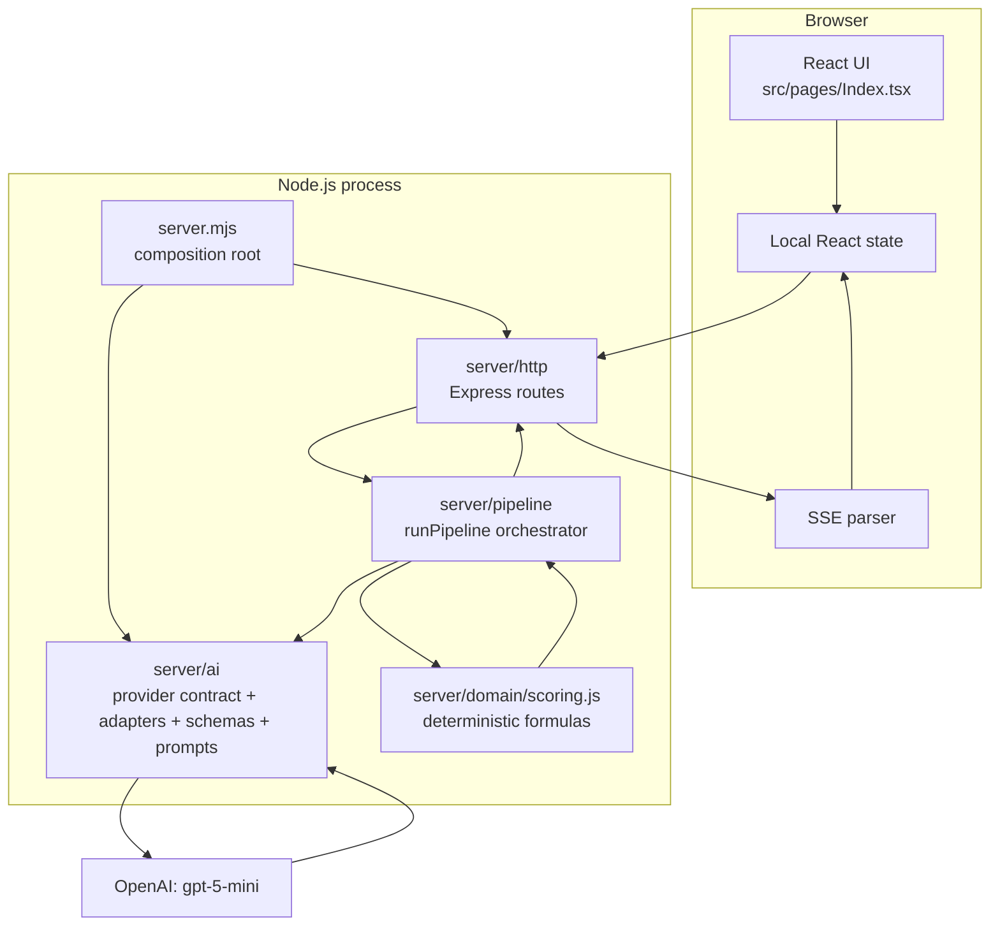

# Current architecture

## Architecture type

The baseline is a small two-process web application:

- a client-rendered React single-page application;
- a Node.js/Express API process;
- a single externally hosted LLM provider — OpenAI (`gpt-5-mini`);
- no persistence layer.

It is best described as an **LLM-assisted sequential decision pipeline with deterministic scoring**, not as a fully autonomous multi-agent system, and (since Phase 1B) as **provider-neutral** — the pipeline calls an `AIProvider` interface, never a specific vendor's SDK directly, even though there is currently exactly one supported provider. Groq and Gemini were real, tested integrations from an earlier phase, removed after a live end-to-end test showed neither could reliably complete a full run on its free tier — see [`docs/decisions/ADR-0004-single-openai-provider.md`](../decisions/ADR-0004-single-openai-provider.md).

## Component diagram



## Frontend

### Entry path

```text
index.html
  -> src/main.tsx
  -> src/App.tsx
  -> src/pages/Index.tsx
```

### Responsibilities currently held by `src/pages/Index.tsx`

- domain and API response types;
- default role, scenarios, candidates, and decision modes;
- health checking;
- scenario generation requests;
- SSE stream parsing;
- request timeout behavior;
- all major page sections and visual components;
- form state and phase transitions;
- result rendering.

This concentration still makes the page the single largest file in the
project. Phase 1D exported its two largest sub-components (`Results`,
`EvalForm`) and moved the backend-URL constant into `src/lib/backendUrl.ts`
so both are independently testable — a small step, not the deeper
feature-folder split that remains Phase 2 (`docs/V2_ROADMAP.md`).

### State model

The page uses local React state for:

- current phase: `landing`, `eval`, `running`, or `results`;
- role and scenario inputs;
- candidate profiles;
- selected decision mode;
- pair-simulation option;
- pipeline stages;
- final response and error state;
- backend AI availability.

No state is persisted across page refreshes.

## Backend

### Runtime

- Node.js using ECMAScript modules;
- Express 5;
- permissive CORS configuration;
- JSON request bodies up to 10 MB;
- calls OpenAI through `server/ai/`, never the `openai` package directly from route or pipeline code;
- environment loaded from `.env`/`.env.local` with real-process-env taking priority (`server/config/env.js`; see `docs/decisions/ADR-0003-runtime-provider-configuration.md`).

### Module boundaries (Phase 1D modularization; Phase 1 post-review simplification, ADR-0004)

| Directory | Responsibility |
|---|---|
| `server.mjs` | Composition root only: load env, resolve the OpenAI provider for the process's lifetime, build the app, listen |
| `server/config/` | `.env`/`.env.local` loading and provider-config validation, `AI_MAX_CANDIDATES`/`AI_MAX_PROVIDER_REQUESTS_PER_RUN` resolution |
| `server/http/` | Express transport — CORS, JSON body parsing, the 4 routes, candidate-count rejection before the model is called. No orchestration or AI logic |
| `server/pipeline/` | `runPipeline()` orchestration, batch-identity validation (`mapBatchResultsById`/`mapPairResultsByIdentity`), the deterministic `confidenceEvidenceReview`/`outcomeModeling` stages, run-metadata assembly (including token usage and estimated cost) |
| `server/ai/` | `AIProvider` contract (`types.js`), error taxonomy (`errors.js`), the single retry owner (`retry.js`), `providerFactory.js`, `providers/openaiProvider.js` (the only adapter), `pricing/openaiPricing.js`, `schemas/`, `prompts/` |
| `server/domain/` | Pure deterministic scoring formulas (no I/O, no provider knowledge) |

This is a "reasonable boundary" split (explicit instruction in Phase 1D),
not a full rewrite: `server/pipeline/runPipeline.js` is still one file
covering every pipeline stage, and the giant frontend page is untouched
beyond the two extractions from Phase 1D.

### Public endpoints

| Method and path | Purpose |
|---|---|
| `GET /health` | Reports server liveness plus AI readiness (`ai_enabled`, `ai_provider`) — never a secret |
| `POST /api/scenarios` | Generates role-specific scenarios via the configured provider, or returns local regex-based fallbacks |
| `POST /api/decision` | Runs the full pipeline and returns one JSON response, including `run_metadata` |
| `POST /api/decision/stream` | Runs the same pipeline and streams stage updates using SSE |

## Pipeline stages

Every LLM-backed stage below calls `provider.generateStructured()` — the
one provider instance resolved at process startup (`server.mjs`) — with a
Zod schema from `server/ai/schemas/` and a prompt from
`server/ai/prompts/`. The response is parsed, retried at most once on
failure, and locally validated against that schema before any deterministic
code sees it (`server/ai/providers/openaiProvider.js`). No stage constructs
or selects a provider itself. A normal run makes **at most 4 provider
requests** (docs/decisions/ADR-0004-single-openai-provider.md); a request
budget (`server/pipeline/runPipeline.js`'s `createRequestBudget`,
configured via `AI_MAX_PROVIDER_REQUESTS_PER_RUN`) is a safety net against
a future bug making more.

### 1. Input validation

The API checks that a role title and scenario exist, that at least two
candidates are supplied, and that the candidate count does not exceed
`AI_MAX_CANDIDATES` — rejected with a 400 before the model is ever called.
Validation is otherwise manual and incomplete; nested fields, string
lengths, allowed decision modes, duplicate IDs are not strictly enforced
at this layer — but the LLM *outputs* now are, via the production schemas.

### 2. Context analysis (1 provider request)

Calls the provider with `contextAnalysisSchema` (`server/ai/schemas/contextAnalysis.schema.js`), which combines what used to be two separate requests — role analysis and scenario analysis — into one. The response has two clearly separated nested objects, `role_analysis` and `scenario_analysis`; the pipeline still records them as distinct `pipeline_stage_outputs` entries ("Role Analysis Stage", "Scenario Analysis Stage") and the frontend still displays them separately. A logical pipeline stage does not necessarily equal one network request. Application code applies weight deltas and normalizes the final weights to 100 (`server/domain/scoring.js`).

### 3. Batch candidate scoring (1 provider request)

Calls the provider once with `buildBatchCandidateScoringSchema(maxCandidates)`, scoring every submitted candidate in a single request (previously one request per candidate, with concurrency limited to two). Each result carries the candidate's stable ID; `mapBatchResultsById()` (`server/pipeline/runPipeline.js`) maps results back to candidates by that ID — never by array position — and rejects the whole batch (with at most one corrective retry, appending a plain-language note of exactly what was wrong) if any ID is duplicated, missing, or unrecognized. Candidate scoring must be complete: unlike pairing (below), a missing result is never silently dropped or defaulted.

### 4. Metric calculation

Normal JavaScript functions (`server/domain/scoring.js`) compute:

- weighted fit score;
- weighted confidence;
- execution risk;
- culture risk;
- time risk;
- adaptability score (Phase 1C: no longer includes a fabricated cross-scenario-consistency input — see `docs/architecture/SCORING_AND_ASSUMPTIONS.md`);
- expected outcome score;
- risk-adjusted score.

These formulas are deterministic given the LLM-produced criterion values and weights.

### 5. Confidence and evidence review

`confidenceEvidenceReview()` (`server/pipeline/runPipeline.js`; renamed from "Bias & Confidence Review" in Phase 1C — see `docs/architecture/KNOWN_LIMITATIONS.md` P0.3) checks:

- criterion confidence below `0.65`;
- overall confidence below `0.60` or `0.65` depending on the decision;
- evidence text shorter than 15 characters;
- the number of low-confidence criteria.

It does not test protected characteristics, proxy variables, disparate treatment, consistency across demographic variants, or historical outcome bias, and its name no longer implies that it does.

### 6. Outcome modeling

`outcomeModeling()` is a deterministic pipeline stage, not an LLM call. It derives risk and outcome labels. **Phase 1C fix:** `cross_scenario_consistency` is no longer a fabricated `75` — it is honestly returned as the literal string `"not_measured"`, and the adaptability-score formula no longer uses that input at all (see `docs/architecture/SCORING_AND_ASSUMPTIONS.md`).

### 7. Batch pairing analysis (1 provider request, optional)

When pairing is enabled, the pipeline derives the top four candidates from this run's actual deterministic ranking (sorted by whichever `decision_mode` was selected — Phase 1C fix, P0.1), builds every relevant pair (up to C(4,2) = 6), and evaluates them all in a single request via `batchPairingAnalysisSchema` (previously one request per pair). `mapPairResultsByIdentity()` validates the returned pairs by `candidate_id_a`/`candidate_id_b`: a duplicate or a pair that was never requested is rejected outright, but a pair the model simply omitted is tolerated as a legitimate partial result — pairing is optional and a real partial result is more useful than none. If nothing usable comes back at all, `pairing_result` is honestly `{"status":"unavailable", "reason": "...", "best_pair": null, "top_pairs": []}` — never a fabricated pair (docs/architecture/KNOWN_LIMITATIONS.md P0.5). Valid pairs are converted into a deterministic pair score (`server/domain/scoring.js`'s `computePairScore`).

### 8. Decision generation (1 provider request)

Application code first sorts candidates deterministically:

- `weighted_fit_score` for `best_fit`;
- `risk_adjusted_score` for `lowest_risk`;
- `expected_outcome_score` for `best_outcome`.

The provider then calls `decisionExplanationSchema` to write explanations, trade-offs, and an executive summary from the already-computed ranking (and, when pairing succeeded or was attempted, an already-known pairing summary the model may reference but never invent or contradict). This ranking-then-explanation order — enforced structurally, not just by convention — is the project's core non-negotiable boundary (`docs/PROJECT_STATUS.md`), and `server/pipeline/runPipeline.test.js` includes a boundary test proving the winner cannot change based on explanation wording.

## Communication model

The frontend normally uses `POST /api/decision/stream`. The backend sends:

- `stage_update` events containing the current stage list;
- one `complete` event containing the final response, including `run_metadata`;
- an `error` event when the pipeline fails;
- comment heartbeats every 15 seconds to keep the connection open.

This SSE contract is unchanged from the pre-migration implementation — the provider swap was designed to be invisible to the frontend. The frontend manually parses the SSE stream from a `fetch()` response rather than using `EventSource`, because the request requires a POST body.

## Run metadata

Every completed pipeline response includes:

```json
{
  "provider": "openai",
  "model": "gpt-5-mini",
  "providerRequestCount": 4,
  "inputTokens": 3200,
  "cachedInputTokens": 0,
  "outputTokens": 1800,
  "reasoningTokens": 0,
  "totalTokens": 5000,
  "estimatedCostUsd": 0.0044,
  "promptVersions": { "context": "v1", "scoring": "v1", "...": "..." },
  "schemaVersions": { "context": "v1", "scoring": "v1", "...": "..." },
  "attempts": { "context": 1, "scoring": 1, "...": 1 },
  "startedAt": "2026-...",
  "completedAt": "2026-..."
}
```

`estimatedCostUsd` is computed from actual token usage against a small versioned pricing table (`server/ai/pricing/openaiPricing.js`) and is `null`, never a guessed number, for any model that table doesn't explicitly recognize. It is a displayed estimate for the user's own budget awareness, not an invoice — OpenAI's own billing dashboard remains the source of truth. No secrets. Supports later debugging and reproducibility without adding a database.

## Data and persistence

The baseline has no database. Inputs and outputs exist only in browser memory and the current HTTP request. There is no run history, audit log, evaluation dataset, user account, or retention/deletion workflow.

## Deployment architecture

The repository does not define a production deployment topology. It assumes:

- frontend development server on port 5173;
- backend server on port 3001 (configurable via `PORT`);
- frontend code calling a configurable backend URL (`VITE_BACKEND_URL`, default `http://localhost:3001`).

V2 has replaced the hardcoded-URL assumption with environment-specific configuration (Phase 1C/1D); a documented production deployment model remains later-phase work (`docs/V2_ROADMAP.md`).
