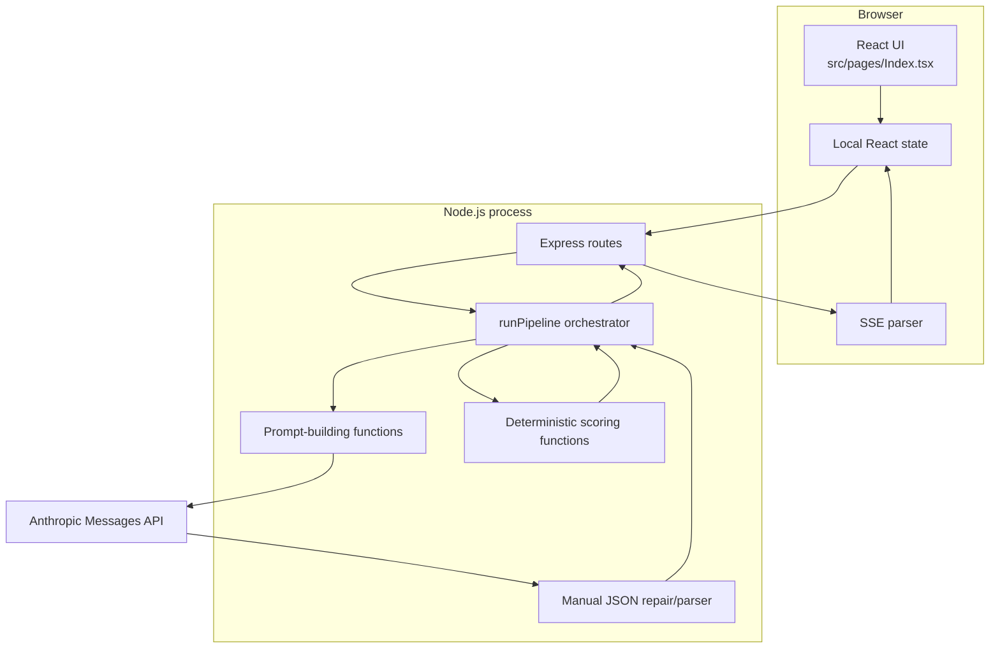

# Current architecture

## Architecture type

The baseline is a small two-process web application:

- a client-rendered React single-page application;
- a Node.js/Express API process;
- an external hosted LLM provider;
- no persistence layer.

It is best described as an **LLM-assisted sequential decision pipeline with deterministic scoring**, not as a fully autonomous multi-agent system.

## Component diagram



## Frontend

### Entry path

```text
index.html
  -> src/main.tsx
  -> src/App.tsx
  -> src/pages/Index.tsx
```

### Responsibilities currently held by `src/pages/Index.tsx`

- domain and API response types;
- default role, scenarios, candidates, and decision modes;
- backend URL configuration;
- health checking;
- scenario generation requests;
- SSE stream parsing;
- request timeout behavior;
- all major page sections and visual components;
- form state and phase transitions;
- result rendering.

This concentration makes the current page easy to copy as a hackathon artifact but difficult to test or evolve safely.

### State model

The page uses local React state for:

- current phase: `landing`, `eval`, `running`, or `results`;
- role and scenario inputs;
- candidate profiles;
- selected decision mode;
- pair-simulation option;
- pipeline stages;
- final response and error state;
- backend AI availability.

No state is persisted across page refreshes.

## Backend

### Runtime

- Node.js using ECMAScript modules;
- Express 5;
- permissive CORS configuration;
- JSON request bodies up to 10 MB;
- direct `fetch` calls to the Anthropic API;
- environment values loaded through a small custom `.env` parser.

### Public endpoints

| Method and path | Purpose |
|---|---|
| `GET /health` | Reports server status and whether an Anthropic key is configured |
| `POST /api/scenarios` | Generates role-specific scenarios or returns local fallbacks |
| `POST /api/decision` | Runs the full pipeline and returns one JSON response |
| `POST /api/decision/stream` | Runs the same pipeline and streams stage updates using SSE |

### Internal responsibilities currently held by `server.mjs`

- environment loading;
- web server configuration;
- model-provider HTTP calls;
- JSON extraction and repair;
- weight normalization;
- all scoring formulas;
- prompt definitions;
- all named “agent” functions;
- retries, timeouts, and concurrency;
- orchestration;
- request validation;
- response assembly;
- SSE connection handling.

## Pipeline stages

### 1. Input validation

The API checks that a role title and scenario exist and that at least two candidates are supplied. Validation is manual and incomplete; nested fields, string lengths, allowed decision modes, duplicate IDs, and output shapes are not strictly enforced.

### 2. Role analysis

`runRoleAgent()` asks the LLM to return:

- seven fixed criteria;
- baseline weights;
- must-have criteria;
- role success definition;
- complexity rating.

The output is parsed as JSON but not validated with a schema.

### 3. Scenario analysis

`runScenarioAgent()` asks the LLM to generate weight deltas and scenario pressures. Normal application code applies deltas and normalizes the final weights to 100.

### 4. Candidate scoring

`runCandidateScoringAgent()` is called once per candidate with concurrency limited to two. The model returns a score, confidence, evidence, and reasoning for each criterion. One retry is attempted for selected transient errors.

### 5. Metric calculation

Normal JavaScript functions compute:

- weighted fit score;
- weighted confidence;
- execution risk;
- culture risk;
- time risk;
- adaptability score;
- expected outcome score;
- risk-adjusted score.

These formulas are deterministic given the LLM-produced criterion values and weights.

### 6. Confidence and evidence review

`runBiasConfidenceAgent()` checks:

- criterion confidence below `0.65`;
- overall confidence below `0.60` or `0.65` depending on the decision;
- evidence text shorter than 15 characters;
- the number of low-confidence criteria.

It does not currently test protected characteristics, proxy variables, disparate treatment, consistency across demographic variants, or historical outcome bias.

### 7. Outcome modeling

`runOutcomeModelingAgent()` is deterministic despite its “Agent” name. It derives risk and outcome labels. Cross-scenario consistency is currently supplied as a fixed value of `75` rather than calculated from multiple scenario runs.

### 8. Decision generation

`runDecisionAgent()` first sorts candidates using application code:

- `weighted_fit_score` for `best_fit`;
- `risk_adjusted_score` for `lowest_risk`;
- `expected_outcome_score` for `best_outcome`.

The LLM then writes explanations, trade-offs, and an executive summary. This is a healthy conceptual boundary, although output validation is still missing.

### 9. Pair simulation

When enabled, pair combinations are evaluated by the LLM and converted into a deterministic pair score. The baseline takes `candidates.slice(0, 4)` before receiving ranked candidates, so it evaluates the first four input candidates rather than the top four decision results.

## Communication model

The frontend normally uses `POST /api/decision/stream`. The backend sends:

- `stage_update` events containing the current stage list;
- one `complete` event containing the final response;
- an `error` event when the pipeline fails;
- comment heartbeats every 15 seconds to keep the connection open.

The frontend manually parses the SSE stream from a `fetch()` response rather than using `EventSource`, because the request requires a POST body.

## Data and persistence

The baseline has no database. Inputs and outputs exist only in browser memory and the current HTTP request. There is no run history, prompt version record, audit log, evaluation dataset, user account, or retention/deletion workflow.

## Deployment architecture

The repository does not define a production deployment topology. It assumes:

- frontend development server on port 5173;
- backend server on port 3001;
- frontend code calling `http://localhost:3001` directly.

V2 must replace that assumption with environment-specific configuration and a documented deployment model.
