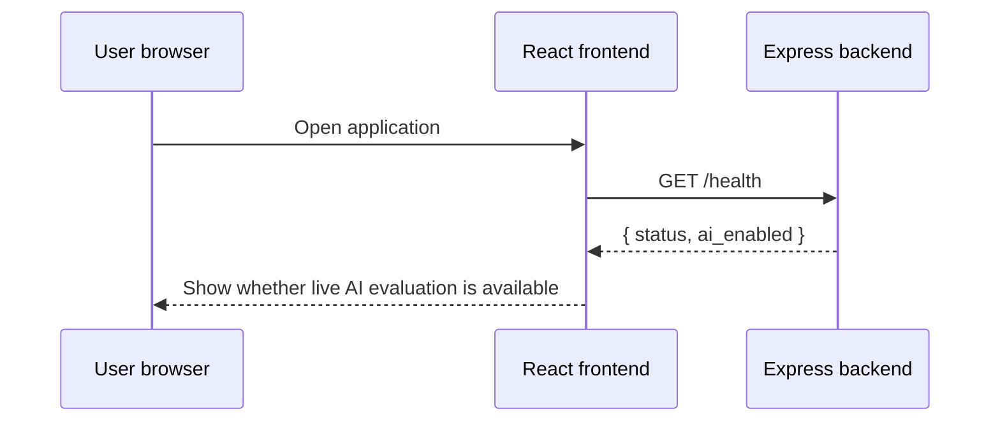
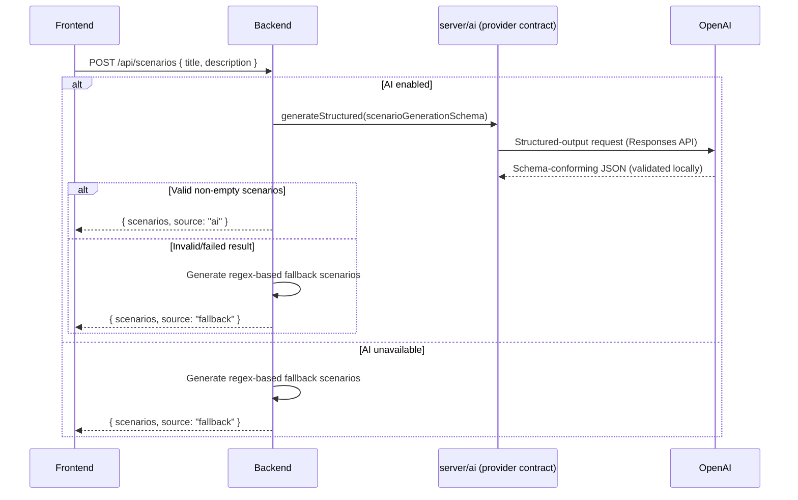

# Data flows

## 1. Application startup and health check



The health endpoint checks whether `OPENAI_API_KEY` (`server/config/env.js`) is present, and reports the configured model (`ai_model`). It does not confirm the key is valid, the model is reachable, or the account has quota.

## 2. Scenario generation



This endpoint is a separate request path and does not count toward the decision pipeline's logical-stage count below.

## 3. Decision pipeline

A normal run uses **at most 4 logical model-backed pipeline stages** (docs/decisions/ADR-0004-single-openai-provider.md) — down from the six-to-nine real calls the pre-batching architecture made per candidate/pair. This is a fixed count of *logical stages*, not a claim about the real OpenAI attempt count: a stage's own retry or a batch-integrity corrective call adds real attempts without adding a stage — see "Run metadata" in `docs/architecture/CURRENT_ARCHITECTURE.md` for `logicalProviderStageCount` vs. `providerAttemptCount`.

```mermaid
sequenceDiagram
    participant F as Frontend
    participant B as Express/SSE route (server/http)
    participant P as runPipeline (server/pipeline)
    participant AI as server/ai (provider contract)
    participant A as OpenAI (gpt-5-mini)
    participant M as Deterministic math (server/domain)

    F->>B: POST /api/decision/stream
    B-->>F: SSE headers
    B->>B: Reject if candidates.length > AI_MAX_CANDIDATES (400/error event, no model call)
    B->>P: Validated request + the one resolved provider
    P-->>F: stage_update: input

    Note over P,A: Logical stage 1 of 4 (may take more than one real attempt)
    P->>AI: generateStructured(contextAnalysisSchema)
    AI->>A: Structured-output request (role_analysis + scenario_analysis together)
    A-->>AI: Response (validated locally against the schema, twice — see ADR-0004)
    AI-->>P: Criteria, base weights, weight deltas, pressures
    P->>M: Apply deltas and normalize weights
    P-->>F: stage_update: context complete

    Note over P,A: Logical stage 2 of 4 (may take more than one real attempt)
    P->>AI: generateStructured(buildBatchCandidateScoringSchema(maxCandidates))
    AI->>A: Structured-output request — every candidate, one call
    A-->>AI: Response (validated)
    AI-->>P: Scores, confidence, evidence, reasoning per candidate_id
    P->>P: mapBatchResultsById — reject duplicate/missing/unknown IDs (one corrective retry, whose real attempt is added to the total, then fail honestly)
    P-->>F: stage_update: scoring complete

    P->>M: Weighted fit and confidence
    P->>M: Confidence/evidence flags (Confidence & Evidence Review)
    P->>M: Risk and outcome formulas (cross_scenario_consistency: "not_measured")
    P->>M: Sort candidates by selected decision mode (ranking is final here)
    P-->>F: stage_update: deterministic stages complete

    opt Pair simulation enabled
        Note over P,A: Logical stage 3 of 4 (only if enabled; may take more than one real attempt)
        P->>AI: generateStructured(batchPairingAnalysisSchema)
        AI->>A: Structured-output request — every relevant top-four pair, one call
        A-->>AI: Response (validated)
        AI-->>P: Pair metric estimates per pair
        P->>P: mapPairResultsByIdentity — require every expected pair, exactly once, no unknown pairs (one corrective retry, whose real attempt is added to the total; otherwise honestly unavailable, never a partial "best pair")
        P->>M: Pair score formula
        P-->>F: stage_update: pairing complete
    end

    Note over P,A: Logical stage 4 of 4 (3 of 3 if pairing disabled; may take more than one real attempt)
    P->>AI: generateStructured(decisionExplanationSchema) using sorted metrics (+ pairing summary if available)
    AI->>A: Structured-output request
    A-->>AI: Response (validated)
    AI-->>P: Explanations, trade-offs, executive summary
    P-->>F: stage_update: decision complete

    P-->>B: Final response object + run_metadata (logicalProviderStageCount, providerAttemptCount, token usage, estimated cost)
    B-->>F: complete event
    F-->>F: Render results
```

## Trust boundaries

### Browser to backend

The browser is untrusted. Candidate names, descriptions, scenario text, option values, and IDs can be manipulated before reaching the backend. Current validation does not sufficiently constrain them.

### Backend to model provider

Candidate and role text leave the application boundary and are sent to an external model provider. V2 documentation must explain this data transfer and avoid sending unnecessary personal data.

### Model output to deterministic code

Model output is untrusted structured data. Every LLM operation's response is now validated against a production Zod schema (`server/ai/schemas/`) — exact keys, enums, numeric ranges, and array/object shapes are enforced, with one controlled retry on failure — before any deterministic formula sees it (`server/ai/providerBase.js`). Semantic consistency (e.g., "is this evidence actually about this candidate") is still not validated — schemas check shape and range, not meaning.

### Deterministic code to explanation model

The explanation prompt includes computed metrics. The LLM should explain them without modifying the ranking, but the final narrative can still contradict or overstate the numbers unless validated.

## Failure paths

- missing/invalid `OPENAI_API_KEY`: in development, scenario generation falls back and decision endpoints reject live evaluation (503); in production, the process fails to start at all (`docs/decisions/ADR-0003-runtime-provider-configuration.md`);
- too many candidates submitted: rejected with a clear 400/error event before the model is ever called (`AI_MAX_CANDIDATES`);
- a refusal (the model declines to answer): mapped distinctly, never retried blindly;
- a truncated/incomplete response: retried at most once, with a justified larger output-token budget, never the same insufficient one twice;
- schema-invalid or malformed model output: one controlled retry with a sanitized validation summary (never raw output), then the stage fails;
- a batch response with a duplicate, missing, or unknown candidate/pair identity: one controlled corrective retry (a plain-language note of exactly what was wrong, whose real attempt is added to `providerAttemptCount` even though its result is discarded), then the stage fails honestly — candidate scoring never silently drops or defaults a candidate; pairing requires complete coverage of every expected pair, so a merely-missing pair is rejected the same as a duplicate or unknown one, never tolerated as a partial "best pair" result;
- provider timeout, rate limit (a safe, capped Retry-After delay is honored when reported), or transient server error: one controlled retry, then the stage fails;
- a bug or future code change that would enter more than the fixed `MAX_LOGICAL_PROVIDER_STAGES` (4) logical stages in one run: fails safely with a non-retryable `LogicalStageLimitExceededError` instead of spending API credit unexpectedly (`server/pipeline/runPipeline.js`) — this is a safety net against a future bug adding a 5th call site, not a normal-path limit, and it is deliberately about logical stages, not raw attempt count: retries and corrective calls within the existing 4 stages never trip it;
- total pipeline timeout: the route emits an error after 150 seconds;
- pairing incomplete after the corrective retry (missing, duplicate, or unknown pairs) or the pairing call failing entirely: `pairing_result` is honestly `{"status":"unavailable","reason":"Complete pair analysis was unavailable.","best_pair":null,"top_pairs":[]}` — never a fabricated or partial-coverage pair, and the stage's real attempts/usage are still recorded in `run_metadata`;
- frontend timeout: the request is aborted after three minutes;
- page refresh: all current input and result state is lost;
- no silent provider fallback: there is exactly one provider (OpenAI); nothing in this codebase catches a failure and silently retries against a different provider or model.

Phase 2A adds a transport-validation checkpoint on both sides of this flow:
malformed browser input stops at Express with a safe 400/error event; malformed
server data stops before the UI renders it with a safe frontend error.
