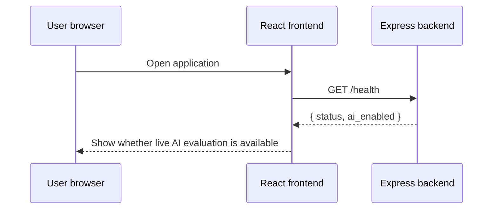
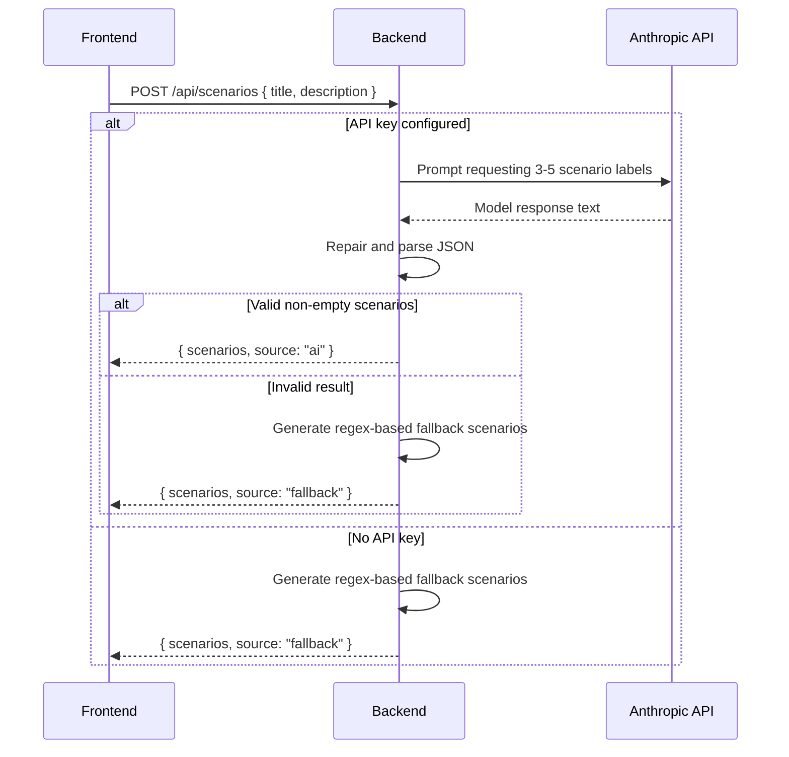
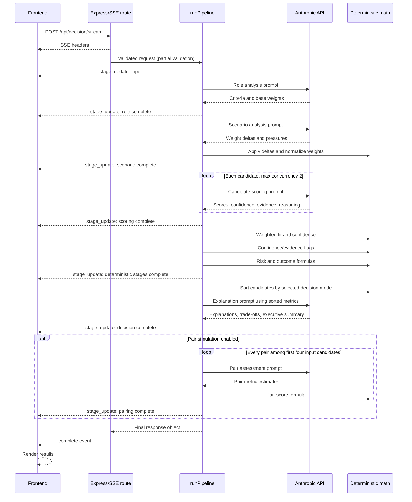

# Data flows

## 1. Application startup and health check

The health endpoint only checks whether an API key string exists. It does not confirm that the key is valid, the model is reachable, or the provider account has quota.

## 2. Scenario generation

## 3. Decision pipeline

## Trust boundaries

### Browser to backend

The browser is untrusted. Candidate names, descriptions, scenario text, option values, and IDs can be manipulated before reaching the backend. Current validation does not sufficiently constrain them.

### Backend to model provider

Candidate and role text leave the application boundary and are sent to an external model provider. V2 documentation must explain this data transfer and avoid sending unnecessary personal data.

### Model output to deterministic code

Model output is untrusted structured data. The baseline repairs JSON syntax and supplies some fallback values, but it does not validate exact keys, ranges, types, or semantic consistency before formulas use the output.

### Deterministic code to explanation model

The explanation prompt includes computed metrics. The LLM should explain them without modifying the ranking, but the final narrative can still contradict or overstate the numbers unless validated.

## Failure paths

- missing API key: scenario generation falls back; decision endpoints reject live evaluation;
- invalid model JSON: manual repair is attempted, then the pipeline fails;
- provider timeout or overload: selected calls receive one retry;
- total pipeline timeout: the route emits an error after 150 seconds;
- pair-call failures: failed pairs are skipped and a default pair may be returned;
- frontend timeout: the request is aborted after three minutes;
- page refresh: all current input and result state is lost.
