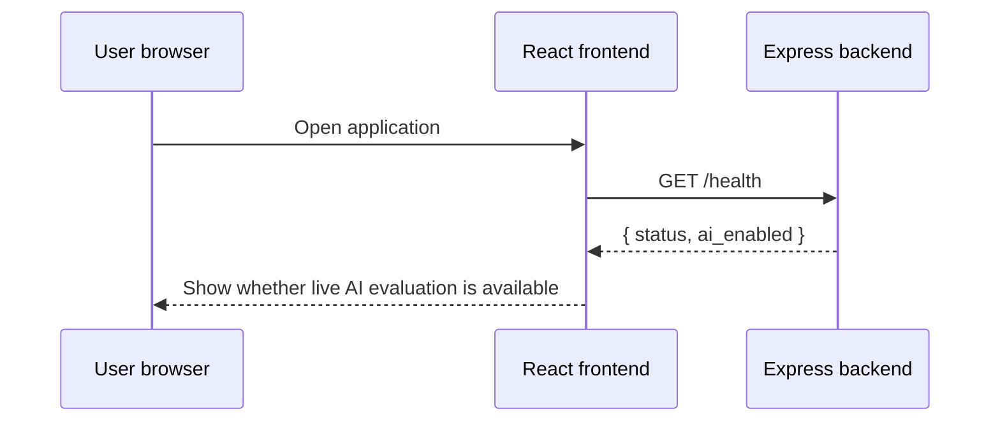
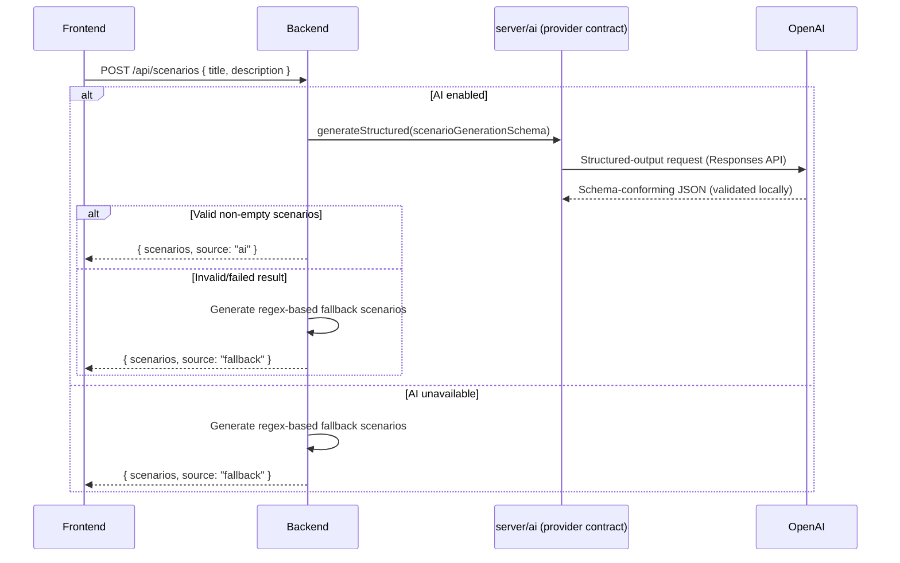

# Data flows

## 1. Application startup and health check



The health endpoint checks whether `OPENAI_API_KEY` (`server/config/env.js`) is present, and reports the configured model (`ai_model`). It does not confirm the key is valid, the model is reachable, or the account has quota.

## 2. Scenario generation



This endpoint is a separate request path and does not count toward the decision pipeline's 4-request budget below.

## 3. Decision pipeline

A normal run makes **at most 4 OpenAI requests** (docs/decisions/ADR-0004-single-openai-provider.md) — down from the six-to-nine calls the pre-batching architecture made per candidate/pair.

```mermaid
sequenceDiagram
    participant F as Frontend
    participant B as Express/SSE route (server/http)
    participant P as runPipeline (server/pipeline)
    participant AI as server/ai (provider contract)
    participant A as OpenAI (gpt-5-mini)
    participant M as Deterministic math (server/domain)

    F->>B: POST /api/decision/stream
    B-->>F: SSE headers
    B->>B: Reject if candidates.length > AI_MAX_CANDIDATES (400/error event, no model call)
    B->>P: Validated request + the one resolved provider
    P-->>F: stage_update: input

    Note over P,A: Request 1 of 4
    P->>AI: generateStructured(contextAnalysisSchema)
    AI->>A: Structured-output request (role_analysis + scenario_analysis together)
    A-->>AI: Response (validated locally against the schema, twice — see ADR-0004)
    AI-->>P: Criteria, base weights, weight deltas, pressures
    P->>M: Apply deltas and normalize weights
    P-->>F: stage_update: context complete

    Note over P,A: Request 2 of 4
    P->>AI: generateStructured(buildBatchCandidateScoringSchema(maxCandidates))
    AI->>A: Structured-output request — every candidate, one call
    A-->>AI: Response (validated)
    AI-->>P: Scores, confidence, evidence, reasoning per candidate_id
    P->>P: mapBatchResultsById — reject duplicate/missing/unknown IDs (one corrective retry, then fail honestly)
    P-->>F: stage_update: scoring complete

    P->>M: Weighted fit and confidence
    P->>M: Confidence/evidence flags (Confidence & Evidence Review)
    P->>M: Risk and outcome formulas (cross_scenario_consistency: "not_measured")
    P->>M: Sort candidates by selected decision mode (ranking is final here)
    P-->>F: stage_update: deterministic stages complete

    opt Pair simulation enabled
        Note over P,A: Request 3 of 4 (only if enabled)
        P->>AI: generateStructured(batchPairingAnalysisSchema)
        AI->>A: Structured-output request — every relevant top-four pair, one call
        A-->>AI: Response (validated)
        AI-->>P: Pair metric estimates per pair
        P->>P: mapPairResultsByIdentity — reject duplicate/unknown pairs; tolerate a missing pair as partial success
        P->>M: Pair score formula
        P-->>F: stage_update: pairing complete
    end

    Note over P,A: Request 4 of 4 (3 of 3 if pairing disabled)
    P->>AI: generateStructured(decisionExplanationSchema) using sorted metrics (+ pairing summary if available)
    AI->>A: Structured-output request
    A-->>AI: Response (validated)
    AI-->>P: Explanations, trade-offs, executive summary
    P-->>F: stage_update: decision complete

    P-->>B: Final response object + run_metadata (provider request count, token usage, estimated cost)
    B-->>F: complete event
    F-->>F: Render results
```

## Trust boundaries

### Browser to backend

The browser is untrusted. Candidate names, descriptions, scenario text, option values, and IDs can be manipulated before reaching the backend. Current validation does not sufficiently constrain them.

### Backend to model provider

Candidate and role text leave the application boundary and are sent to an external model provider. V2 documentation must explain this data transfer and avoid sending unnecessary personal data.

### Model output to deterministic code

Model output is untrusted structured data. Every LLM operation's response is now validated against a production Zod schema (`server/ai/schemas/`) — exact keys, enums, numeric ranges, and array/object shapes are enforced, with one controlled retry on failure — before any deterministic formula sees it (`server/ai/providerBase.js`). Semantic consistency (e.g., "is this evidence actually about this candidate") is still not validated — schemas check shape and range, not meaning.

### Deterministic code to explanation model

The explanation prompt includes computed metrics. The LLM should explain them without modifying the ranking, but the final narrative can still contradict or overstate the numbers unless validated.

## Failure paths

- missing/invalid `OPENAI_API_KEY`: in development, scenario generation falls back and decision endpoints reject live evaluation (503); in production, the process fails to start at all (`docs/decisions/ADR-0003-runtime-provider-configuration.md`);
- too many candidates submitted: rejected with a clear 400/error event before the model is ever called (`AI_MAX_CANDIDATES`);
- a refusal (the model declines to answer): mapped distinctly, never retried blindly;
- a truncated/incomplete response: retried at most once, with a justified larger output-token budget, never the same insufficient one twice;
- schema-invalid or malformed model output: one controlled retry with a sanitized validation summary (never raw output), then the stage fails;
- a batch response with a duplicate, missing, or unknown candidate/pair identity: one controlled corrective retry (a plain-language note of exactly what was wrong), then the stage fails honestly — candidate scoring never silently drops or defaults a candidate; a merely-missing pair (not a duplicate/unknown one) is tolerated as a partial pairing result;
- provider timeout, rate limit (a safe, capped Retry-After delay is honored when reported), or transient server error: one controlled retry, then the stage fails;
- a bug or future code change that would make more than `AI_MAX_PROVIDER_REQUESTS_PER_RUN` provider requests in one run: fails safely instead of spending API credit unexpectedly (`server/pipeline/runPipeline.js`'s request budget);
- total pipeline timeout: the route emits an error after 150 seconds;
- all pairing evaluations failing or returning nothing usable: `pairing_result` is honestly `{"status":"unavailable", ...}` — never a fabricated pair;
- frontend timeout: the request is aborted after three minutes;
- page refresh: all current input and result state is lost;
- no silent provider fallback: there is exactly one provider (OpenAI); nothing in this codebase catches a failure and silently retries against a different provider or model.
