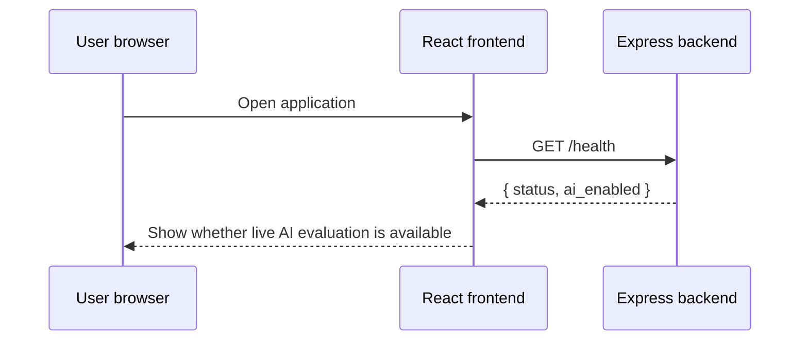
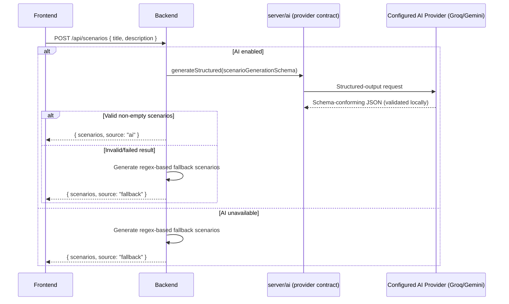
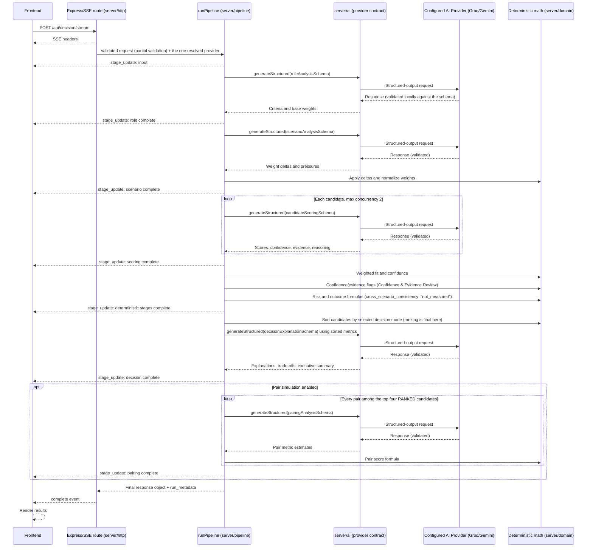

# Data flows

## 1. Application startup and health check

The health endpoint checks whether the configured provider (Groq or Gemini, `server/config/env.js`) has its required key/model present. It does not confirm the key is valid, the model is reachable, or the provider account has quota.

## 2. Scenario generation

## 3. Decision pipeline

## Trust boundaries

### Browser to backend

The browser is untrusted. Candidate names, descriptions, scenario text, option values, and IDs can be manipulated before reaching the backend. Current validation does not sufficiently constrain them.

### Backend to model provider

Candidate and role text leave the application boundary and are sent to an external model provider. V2 documentation must explain this data transfer and avoid sending unnecessary personal data.

### Model output to deterministic code

Model output is untrusted structured data. Every LLM operation's response is now validated against a production Zod schema (`server/ai/schemas/`) — exact keys, enums, numeric ranges, and array/object shapes are enforced, with one controlled retry on failure — before any deterministic formula sees it (`server/ai/providerBase.js`). Semantic consistency (e.g., "is this evidence actually about this candidate") is still not validated — schemas check shape and range, not meaning.

### Deterministic code to explanation model

The explanation prompt includes computed metrics. The LLM should explain them without modifying the ranking, but the final narrative can still contradict or overstate the numbers unless validated.

## Failure paths

- missing/invalid provider configuration: in development, scenario generation falls back and decision endpoints reject live evaluation (503); in production, the process fails to start at all (`docs/decisions/ADR-0003-runtime-provider-configuration.md`);
- schema-invalid or malformed model output: one controlled retry with a sanitized validation summary (never raw output), then the stage fails;
- provider timeout, rate limit, or transient server error: one controlled retry, then the stage fails;
- total pipeline timeout: the route emits an error after 150 seconds;
- pair-call failures: failed pairs are skipped and a default pair may be returned;
- frontend timeout: the request is aborted after three minutes;
- page refresh: all current input and result state is lost;
- no silent provider fallback: a failing Groq call is never silently retried against Gemini, or vice versa.
